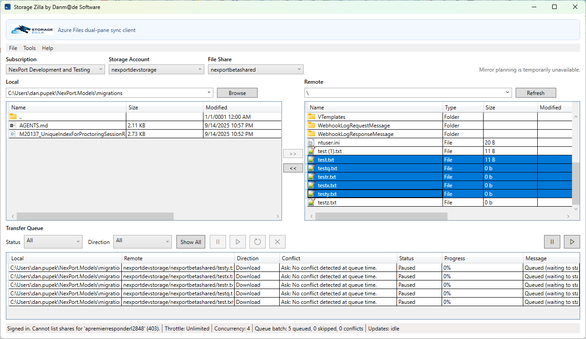

# Storage Zilla User Guide

Storage Zilla is a Windows desktop app for browsing and transferring Azure Storage content (Azure File Shares and Blob Containers) with an FTP-style dual-pane workflow.

Use this guide for setup, daily transfer workflows, and queue operations.

## Guide Contents
- [Getting Started](getting-started.md)
- [UI Tour](ui-tour.md)
- [Transfers](transfers.md)
- [Queue Management](queue-management.md)
- [Buttons and Actions Reference](buttons-and-actions.md)
- [Troubleshooting](troubleshooting.md)

## At a Glance
- Interactive Azure sign-in
- Subscription, storage account, and remote root selection (`File Share` or `Blob Container`)
- Side-by-side local and remote file browsing
- Recursive remote search with scope controls and cancel support
- Queue-based uploads and downloads
- Conflict policies (`Ask`, `Skip`, `Overwrite`, `Rename`)
- Queue controls for pause/resume/retry/cancel

## Screenshot

## Support and Licensing
- Open source license: [LICENSE](../../LICENSE)
- Commercial license: [LICENSE-COMMERCIAL](../../LICENSE-COMMERCIAL)
